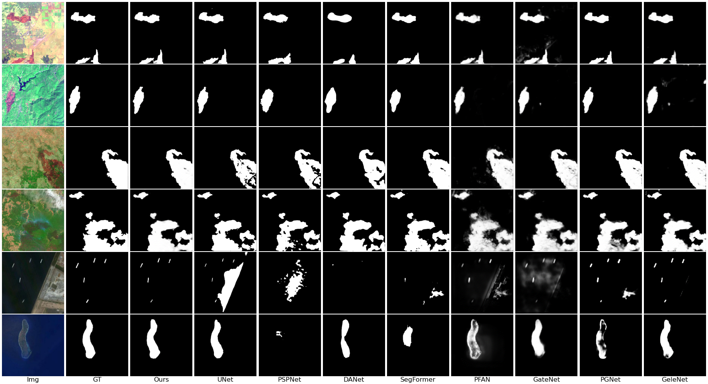

# DBINet
<h1>This is the official repo for DBINet, created by Voruarn from NUIST, NanJing, China. </h1>
<h2>LC8BAS dataset will be made public upon the acceptance of the paper to IEEE GRSL.</h2>
<h3>This is the Major Revision incorporating the reviewers's advice from IEEE GRSL, 2023/12/26.</h3>

<h3>Fig. 1. Overall Architecture of Dual Backbone Interaction Network (DBINet).</h3>

<h3>Fig. 2. Visual comparisons with eight representative methods on the test sets of 3 datasets: LC8BAS (1st, 2nd row), 2019-Bushfire (3rd, 4th row), EORSSD (5th, 6th row).</h3>

